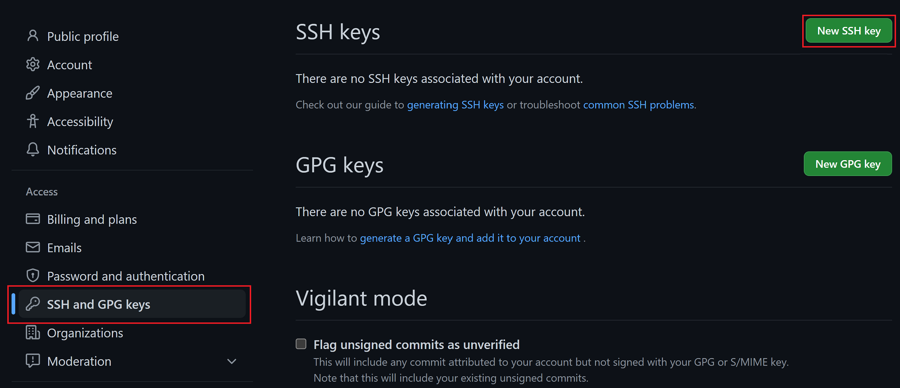
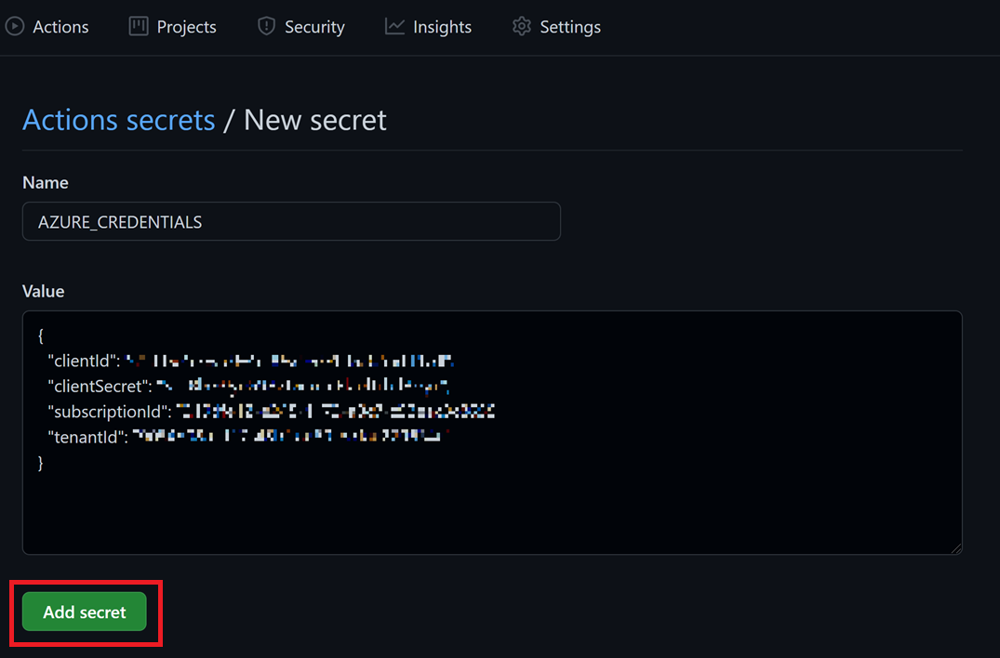

# Deploy to AKS using GitHub Actions

> Estimated Duration: 60 minutes  

## Table of Contents

[Exercise: Configure GitHub](#configure-github)

[Exercise: Create a GitHub Repository](#create-a-fork-of-this-github-repository)

[Exercise: Create the Secrets for the GitHub repo](#create-the-secrets-for-the-github-repo)

[Exercise: Create a Basic CI/CD Pipeline with GitHub Actions](#exercise-create-a-basic-cicd-pipeline-with-github-actions)  

[Exercise: Add a Kubernetes Deploy Step to the Workflow YAML](#add-a-kubernetes-deploy-step-to-the-workflow-yaml)

## Configure GitHub

Use this configuration to prepare GitHub for either one of the following exercises.

Use the same ACR, Azure Key Vault and AKS cluster you created for **Lab 4**.

## Task 1 - Create a GitHub account

1. If you don't already have access to a GitHub account, navigate to: [https://github.com](https://github.com)

1. Click on sign up.

1. Use an email of your choice to create an account.

1. Login to your new account.

## Task 2 - Create a ssh key

1. Generate a SSH key (use your email) and **DO NOT ENTER A PASSPHRASE**.

```bash
ssh-keygen -C "myemail@mycompany.com"
```

## Task 3 - Configure your GitHub SSH Key

1. If you haven't already done so, login to your GitHub account.

1. Select your avatar in the upper right of the user interface and then click on **Settings** in the menu that appears.

1. Click on **SSH and GPG keys** and **New SSH key**.

    

1. Copy the content of the public key (for example, id_rsa.pub) that you generated in your local.

    ```ssh
    cat ~/~.ssh/id_rsa.pub
    ```

1. Name it as ssh key in the **Title section** and paste the content in the **Key** section. Finally, click on **Add SSH key**.

## Create a fork of this GitHub Repository

1. Navigate to this link to create a new [fork](https://github.com/yortch/aks-workshop/fork) (must be logged into your github account).
1. Accept the default values and click on **"Create fork"** which will take you to the forked repository in the browser.
1. From your forked repository click on the **"<> Code"** button. Then click on the **"Create codespace on main"** button.

## Create the Secrets for the GitHub repo

## Task 1 - Create a service principal and grant it access to the AKS resource group

We will create the secrets with Service Principal values, so first we must create a Service Principal.

1. Login to Azure with PowerShell.

    ```bash
    az login
    ```

1. Create a Service Principal and assign it the Contributor role in your resource group (AKS Resource Group). First export required variables:

    ```bash
    # Variables
    INITIALS="abc"
    RESOURCE_GROUP=aks-$INITIALS-rg
    SP_NAME="sp-aks-${INITIALS}-gh"
    ```

1. Next get required resource group and subscription ids:

    ```bash
    resourceGroupId=$(az group show --name $RESOURCE_GROUP --query id --output tsv)
    ```

1. Create service principal and copy output:

    ```bash
    az ad sp create-for-rbac --name $SP_NAME --role Contributor \
    --scopes $resourceGroupId \
    --query "{clientId: appId, clientSecret: password, tenantId: tenant}"
    ```

1. Next output the subscription id value:

    ```bash
    az account show --query "{subscriptionId: id}"
    ```

1. Manually append the subscription id into the output of the service principal as valid json so that it looks like this:

    

1. Copy the output temporarily as it will be used in the next steps.

## Task 2 - Create the GitHub Action Secret to deploy to AKS cluster

You've created the service principal. Next, create secrets in the GitHub Repository.

1. In your browser, navigate to the fork of your GitHub repository.

1. Click on on the **Settings** of the project (not the user setting).

1. Under **Security** click on **Secrets and variables** then click on **Actions**

1. Click on **New repository secret**.

1. Name the secret as **AZURE_CREDENTIALS**.

1. In the **Value** field, paste the JSON object that you copied in the previous section.

1. Click **Add secret**.

    

## Task 3 - Create the GitHub Actions Secrets for the Azure Container Registry Authentication

1. Select New repository secret.

1. Name the secret as **ACR_CLIENT_ID**.

1. In the **Value** field, paste the **"clientId"** value of the JSON object that you copied in the previous section.

1. Select **Add secret**.

    

1. Select New repository secret.

1. Name the secret as **ACR_CLIENT_PASSWORD**.

1. In the **Value** field, paste the **"clientSecret"** value of the JSON object that you copied in the previous section in the .txt file.

1. Click **Add secret**.

    

## Exercise: Create a Basic CI/CD Pipeline with GitHub Actions

**NOTE:** This section task can be completed from local environment or from Github Codespaces

## Task 1 - Create the GitHub Action

1. To create a GitHub Action, you need to have a **workflow.yaml** in the **.github\workflows** directory. Create the **\.github\workflows** folder:

    ```bash
    mkdir -p .github/workflows
    ```

1. Create the `workflow.yaml` file in the new directory with this content. **_NOTE:_** This workflow build, tag, and push the web image to your Azure Container Registry:

    ```yaml
    name: Demo-API-CI

    on:
    push:
        branches:
        - main

    env:
    APP_NAME: demo-api
    NAMESPACE: ghdemo
    LOGIN_SERVER: <acrServerName>
    CLUSTER_NAME: <clusterName>
    CLUSTER_RESOURCE_GROUP: <clusterResourceGroup>     

    jobs:
    build:
        runs-on: ubuntu-latest
        steps:   
        - name: Check Out Repo 
        uses: actions/checkout@v2

        # Connect to Azure Container Registry (ACR)
        - name: ACR login
        uses: azure/docker-login@v1
        with:
            login-server: ${{ env.LOGIN_SERVER }}
            username: ${{ secrets.ACR_CLIENT_ID }}
            password: ${{ secrets.ACR_CLIENT_PASSWORD }}

        # Container build and push to a Azure Container Registry (ACR)
        - name: Build, tag, and push image to ACR
        uses: docker/build-push-action@v2
        with:
            context: ./src/demoapi
            file: Dockerfile
            push: true
            tags: |
                ${{ env.LOGIN_SERVER }}/${{ env.APP_NAME }}:${{ github.run_number }}
    ```

    > **_NOTE:_** Take in to account that all the workflow.yaml created in this lab will run whenever you push a change in the main branch of the GitHub repository.

    ```yaml
    on:
    push:
        branches:
        - main
    ```

1. Obtain the Azure Container Registry Server Name.

    ```bash
    $ACR_SERVER_NAME=(az acr show -n $ACR_NAME --query loginServer -o tsv)
    ```

1. Replace the **workflow-web1.yaml** file with the correct values and create the right file **workflow.yaml** in the right path.

    ```bash
    sed -e "s/<acrServerName>/$ACR_SERVER_NAME/" \
        -e "s/<clusterName>/$AKS_NAME/" \
        -e "s/<clusterResourceGroup>/$RESOURCE_GROUP/" workflow.yaml
    ```

1. Commit and push changes to git repository:

    ```bash
    git add .
    git commit -m "Create the workflow.yaml"
    git push
    ```

1. Now you can see your GitHub Action in the Actions tab of your Repository.

1. Click on **Create the workflow.yaml** and then click on build, you can see all the steps of your job.

    > **_NOTE:_** This GitHub Action builds an image with a Dockerfile and push that image to your Azure Container Registry, the name of the image is specified in the Environment variable **APP_NAME: demo-api**, and the image tag is the **github.run_number**.

1. Go to the Azure Portal and check your Azure Container Registry Repositories.

1. Click on the **demo-api** Repository and you can see your tag.

## Add a Kubernetes Deploy Step to the Workflow YAML

## Task 1 - Deploy the new workflow.yaml

1. To create a the new GitHub Action, you need to append the **workflow.yaml** content in the **.github\workflows** directory with the content below.

    > **_NOTE:_** This adds new steps to deploy the app in the AKS cluster.

    ```yaml
        # Set the target Azure Kubernetes Service (AKS) cluster. 
        - uses: azure/aks-set-context@v1
            with:
            creds: '${{ secrets.AZURE_CREDENTIALS }}'
            cluster-name: ${{ env.CLUSTER_NAME }}
            resource-group: ${{ env.CLUSTER_RESOURCE_GROUP }}

        # Create namespace if doesn't exist
        - run: |
            kubectl create namespace ${{ env.NAMESPACE }} --dry-run -o json | kubectl apply -f -
        # Deploy app to AKS
        - uses: azure/k8s-deploy@v1
            with:
            manifests: |
                manifests/k8s-deployment.yaml
                manifests/k8s-service.yaml
            images: |
                ${{ env.LOGIN_SERVER }}/${{ env.APP_NAME }}:${{ github.run_number }}
            namespace: ${{ env.NAMESPACE }}
    ```

1. Push the changes to your GitHub Repository fork.

    ```PowerShell
    git add .
    git commit -m "Update the the workflow.yaml and k8s-deployment.yaml"
    git push
    ```

1. Next trigger a new workflow run in the Actions tab of your GitHub Repository.


1. Copy the next command in the terminal to check your cluster for the expected resources:

```PowerShell
kubectl get all
```

1. Once the `EXTERNAL-IP1` for the `service/demo-api` has been assigned a value (you may have to wait a few minutes), open a browser and enter that IP address in your address bar:

1. Verify that the correct image was deployed

    ```bash
    kubectl get pods -o jsonpath="{.items[*].spec.containers[*].image}"
    ```

    You should see the full name of the image, for example:

    ```txt
    acrpacyowrfzcd.azurecr.io/demo-api:3
    ```

CONGRATULATIONS!!! You just built a full CI/CD pipeline from code to Kubernetes.
